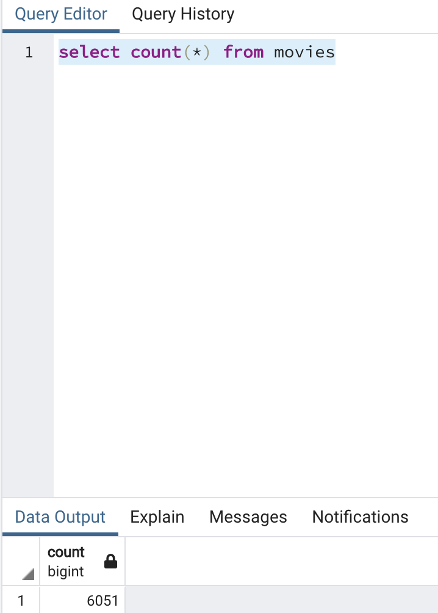
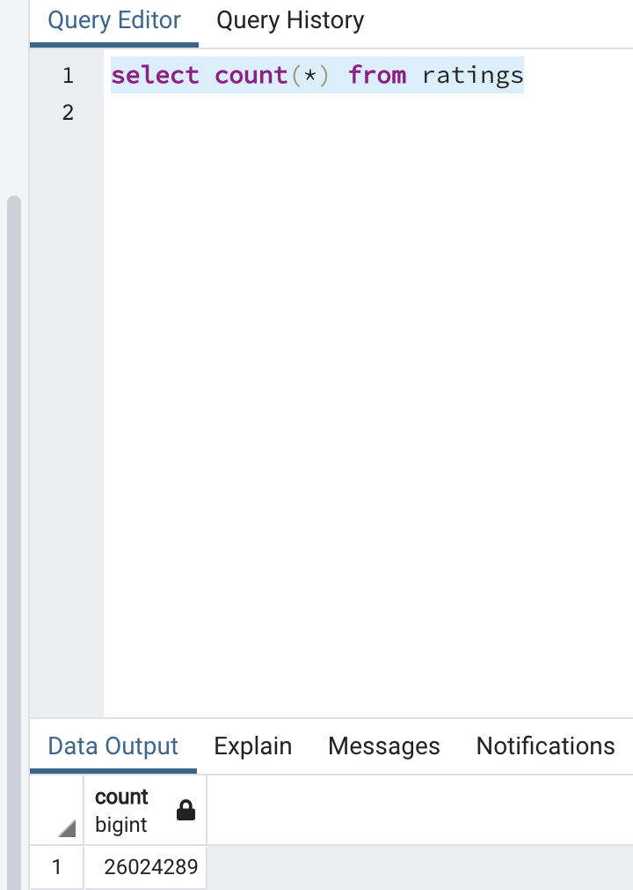

# Movies-ETL

## Purpose of analysis
Analysis of wikipedia movies and Movielens kaggle data, requiring extraction, transformation using pandas, Python3, then dataframes were merged and loaded to PostgreSQL database.

## Results
After the ETL process, the total counts of the movies and ratings tables were confirmed in PostgreSQL:

